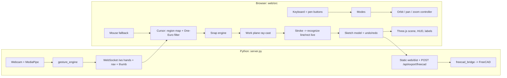

---

name: AirCAD 3D Pen Sketching
overview: Rebuild the app as a browser-based 3D sketching UI (Three.js + TypeScript) driven by a Python webcam tracker over a local WebSocket, with a mm coordinate system, work planes, line/rectangle recognition with live preview, CAD-style snapping, 3D orbit/pan, and pen buttons simulated by keys.
todos:

- id: git-init
content: git init, add .gitignore, commit current state so the restructure is recoverable
status: pending
- id: py-server
content: "Create tracker/camera.py (moved helpers) and server.py: camera thread, aiohttp static + /ws hands/nav/thumb broadcast, --no-camera flag, browser auto-open; add aiohttp to requirements"
status: pending
- id: web-scaffold
content: Scaffold web/ with Vite + TS + three + vitest; viewport with Z-up cameras (persp/ortho), ground grid, axis triad, resize handling
status: pending
- id: cursor-input
content: Tracker WebSocket client with reconnect, region mapping, One-Euro filter; mouse fallback source; keymap.ts with hold/press actions and Mac/Windows modifier handling
status: pending
- id: orbit-nav
content: Orbit/pan/zoom controller driven by pen deltas (Shift/Ctrl hold), mouse, wheel, preset views 1/2/3/0, fit, optional off-hand palm nav from engine deltas (N toggle)
status: pending
- id: workplane
content: WorkPlane model (XY/XZ/YZ through anchor, basis, ray-cast, 2D<->3D) + translucent plane visual with grid; Tab cycling and anchor rules on stroke start/end
status: pending
- id: sketch-model
content: Sketch entities (line, rect), undo/redo command stack, serialization, vertex/midpoint/edge queries, bounding box
status: pending
- id: snap-engine
content: Screen-space snapping (vertex > midpoint > axis-align > edge > grid), adaptive grid step, snap type for cursor glyph, optional X/Y/Z hard locks
status: pending
- id: recognize
content: "Stroke recognizer in plane 2D: line and rectangle (axis-aligned/oriented) with corner-to-vertex pulling; run live for ghost preview, commit on release, discard with feedback otherwise"
status: pending
- id: renderer-feedback
content: Sketch renderer with Line2 fat lines, vertex dots, hover highlight, ghost preview, CSS2D dimension labels, cursor glyph + xyz readout
status: pending
- id: hud-ui
content: HUD chips, context key bar, toasts, help overlay (H), camera PIP (P) with fingertip + region, edge-on plane hint
status: pending
- id: measure-commands
content: commands.ts (setDimension etc.) and L measurement input for lines (length) and rectangles (WxH), ready for voice/AI reuse
status: pending
- id: freecad-3d
content: Update freecad_bridge/freecad_import for 3D mm entities (faces for rectangles); POST /api/export/freecad; E key
status: pending
- id: cleanup-scripts
content: Remove OpenCV UI loop, shape_recognition.py and their tests; new install/Start AirCAD scripts for Windows + Mac; rewrite README with pen workflow and house walkthrough
status: pending
- id: tests
content: Vitest suites for recognize/snap/plane/sketch/commands; Python tests for protocol, bridge, importer; run everything plus manual --no-camera house flow
status: pending
isProject: false

---

# AirCAD: pen-driven 3D sketching (web frontend + Python tracker)

## Current state (what changes and why)

- `hand_tracker.py` is a single OpenCV window: 2D strokes over the webcam image, pinch-to-draw, 2D pan/zoom/rotate. HighGUI has no key-up events, no text input, no 3D; that is the root of the "sloppy" feel.
- `shape_recognition.py` snapping never visibly works because it only *toggles display* (`S`) and requires a nearly perfectly closed stroke; there is no live preview and no coordinate system to snap to.
- `gesture_engine.py` (hand matching, pinch/open-palm hysteresis, nav deltas) is solid and gets reused as-is by the tracker.
- No git repo exists. Step 0 is `git init` + commit so the restructure is recoverable.

## Architecture

- Python keeps only tracking + export. Frontend owns all CAD logic so voice/AI later just call the same `commands` API.
- Protocol message (30 fps): `{type:"hands", frame:{w,h}, hands:[{id, handedness, tip:[x,y,z?], palm:[x,y], pinching, open, openArmed, landmarks}], nav:{mode,pan,zoom}|null}`; optional `{type:"thumb", jpeg}` at ~12 fps for the camera PIP. `tip` carries an optional `z` so a depth camera later needs no protocol change.

## Interaction design (pen buttons as keys; single `keymap.ts` is the source of truth)

- Cursor = tracked index fingertip (later: pen tip). A central region of the camera frame (~12% margins) maps to the full viewport; One-Euro filtered. Mouse drives the cursor when no hand is visible (also makes the app testable without a webcam).
- Pen button 1 = `Space` (hold): draw. Press = pen down, release = pen up. Tracking loss mid-stroke pauses point capture instead of ending the stroke.
- Pen button 2 = `Shift` (hold): orbit by moving the pen. Pen button 3 = `Ctrl` (hold): pan. `=`/`-` and mouse wheel: zoom. Orbit pivot = sketch bounding-box center (origin when empty).
- Off-hand gesture assist (optional, `N` toggles): one open palm held = orbit, two palms = pan + zoom, reusing `GestureEngine` nav deltas; suppressed while the draw key is held.
- Views and planes: `1` Top, `2` Front, `3` Right, `0` Iso, `5` toggle ortho/perspective, `F` fit all. `1/2/3` also set the work plane to XY/XZ/YZ; `Tab` cycles the plane without moving the camera.
- Work plane rule: plane passes through the `anchor`. Anchor = origin initially, moves to the last committed point on stroke end, and to a snapped vertex on stroke start. This is what makes "draw a wall rectangle connecting to the floor rectangle" work: hover a floor corner (vertex snap), press draw, plane shifts through that corner, draw upward.
- Snapping priority: vertex > midpoint > axis-align to stroke start (U/V of the plane, ±8°) > edge > grid (adaptive 1/10/100 mm, `G` toggles) > free. Vertex/midpoint/edge snaps are computed in screen space (~14 px) so off-plane vertices are reachable. Optional hard axis locks `X/Y/Z` while drawing.
- Recognition on release, previewed live every frame as a dashed ghost with dimensions:
  - Line: path/chord < 1.15 and small max deviation -> segment start->end, axis-snapped, endpoint-snapped.
  - Rectangle: closed loop (gap < 15% of bbox diagonal), RDP gives 4-6 corners, turning ~2π, area ratio to bbox > 0.75 -> axis-aligned rectangle in plane axes (oriented fit if rotated > 12°); corners pulled onto nearby existing vertices.
  - Otherwise the stroke fades out with a toast "Not recognized: draw a straight line or a closed rectangle".
- Editing: `Ctrl/Cmd+Z` undo, `Ctrl+Shift+Z`/`Ctrl+Y` redo, `Delete` hovered or last entity, `Esc` cancel stroke, `Ctrl+Backspace` clear.
- Measurement (temporary stand-in for voice): `L` opens an input at the status bar; `4000` sets the hovered/last line length keeping start + direction; `4000x3000` resizes a rectangle keeping its origin corner. Implemented as `commands.setDimension(entityId, spec)` so voice/AI reuse it.
- `E` export to FreeCAD, `P` toggle camera PIP, `H` help overlay.

## Feedback system

- HUD chips: mode (READY / DRAWING / ORBIT / PAN), plane (XY Top / XZ Front / YZ Right) tinted by normal axis color, snap type, grid step, tracking state (Hand / Lost / Mouse).
- Cursor glyph changes with snap type (square = vertex, triangle = midpoint, diamond = edge, dot = grid) plus a small `x y z mm` readout.
- Ghost preview + live length / W×H labels during a stroke (CSS2DRenderer); labels on hover and on the last committed entity.
- Translucent work-plane quad with its own grid, vertex dots on the model, hovered entity highlight, "plane is edge-on, press Tab or 1/2/3" hint.
- Toasts for every commit/undo/export/error; context-sensitive key bar at the bottom.
- Camera PIP (bottom-right) with the fingertip dot and the active mapping rectangle so users see they are in frame.

## Project layout after the change

- `server.py` - entry point: camera thread reusing `open_camera`/`ensure_model`/`observations_from_result` moved from `hand_tracker.py` into `tracker/camera.py`; aiohttp app serving `web/dist`, `/ws`, `/api/export/freecad`; opens the browser; `--no-camera` for dev.
- `gesture_engine.py` unchanged. `shape_recognition.py`, `hand_tracker.py` UI loop, `tests/test_camera_pipeline.py`, `tests/test_shape_recognition.py` removed (recognition moves to TS; history preserved in git).
- `freecad_bridge.py` / `freecad_import.py`: accept 3D points in mm (SCALE 1), entities with `type`; rectangles become `Part.Face` wires so walls render as faces.
- `web/` - Vite + TypeScript + three (`Line2` fat lines, `CSS2DRenderer`), vitest. `src/input/{keymap,tracker-client,mouse-source,one-euro}.ts`, `src/scene/{viewport,orbit,grid,workplane-visual}.ts`, `src/model/{plane,sketch,snap,recognize,commands}.ts`, `src/render/sketch-renderer.ts`, `src/ui/{hud,toast,help,pip,measure-input}.ts`, `src/main.ts`.
- `install.bat` / `install.command`: venv + pip + `npm install` + `npm run build`. `Start AirCAD.bat` / `.command` replace `Start Drawing.*` and run `server.py`. `.gitignore` for `.venv*`, `web/node_modules`, `web/dist`, `.runtime`, `hand_landmarker.task`. README rewritten around the pen workflow and the house walkthrough.

## Verification

- Vitest: `recognize.ts` (straight, wavy, jittered closed rectangle, rotated rectangle, scribble, tiny stroke), `snap.ts` priorities and tolerances, `plane.ts` project/unproject round-trips, `sketch.ts` undo/redo, `commands.ts` dimension edits.
- Python unittest: protocol serialization, 3D bridge validation, importer conversion; existing `test_gesture_engine.py` stays green.
- Manual: `python server.py --no-camera` + mouse to run the house flow (floor rectangle -> Tab -> corner snap -> wall rectangles -> roof lines -> export), then the same with the webcam on Windows; scripts checked for Mac path handling.

